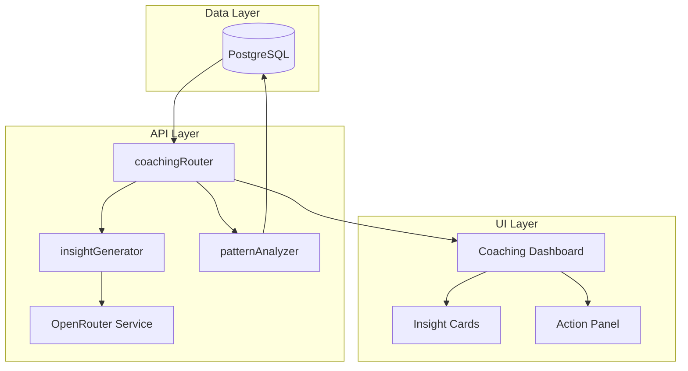

## Detailed Implementation Plan

### Architecture Overview

### Step-by-Step Implementation

#### Step 1: Database Schema

Create new schema files in [`packages/db/src/schema/`](packages/db/src/schema/):

1. **`coaching-insights.ts`** - Store AI-generated insights
2. **`user-patterns.ts`** - Persistent pattern data
3. **`coaching-sessions.ts`** - Track user interactions

#### Step 2: Database Queries

Create new query files in [`packages/db/src/queries/`](packages/db/src/queries/):

1. **`coaching.ts`** - Insight CRUD operations
2. **`user-patterns.ts`** - Pattern storage/retrieval

#### Step 3: API Router

Create [`packages/api/src/routers/coaching.ts`](packages/api/src/routers/coaching.ts:1) with:

- `getInsights` - Fetch user's coaching insights
- `generateInsight` - Trigger new insight generation
- `dismissInsight` - Remove/hide an insight
- `getPatterns` - Retrieve stored patterns
- `logAction` - Track user actions on insights

#### Step 4: AI Services

Create services in [`packages/api/src/services/coaching/`](packages/api/src/services/):

1. **`insight-generator.ts`**
   - Analyzes user data patterns
   - Generates personalized insights using OpenRouter
   - Categories: productivity, burnout, goal alignment, scheduling

2. **`pattern-analyzer.ts`** (extends morning-intention.ts)
   - Multi-week trend analysis
   - Seasonal pattern detection
   - Productivity score calculation

#### Step 5: Frontend Integration

Create components in [`apps/native/components/coaching/`](apps/native/components/coaching/):

1. **`coaching-dashboard.tsx`** - Main coaching screen
2. **`insight-card.tsx`** - Display individual insights
3. **`insight-list.tsx`** - Scrollable list of insights
4. **`coaching-action-sheet.tsx`** - Apply/dismiss/snooze actions
5. **`coaching-history.tsx`** - Past insights

#### Step 6: Connect to Existing Features

1. Link [`coaching-banner.tsx`](apps/native/components/home/coaching-banner.tsx:1) to real data
2. Connect morning intentions to coaching service
3. Add coaching insights to home screen

### Key Design Decisions

1. **Insight Types**:
   - `productivity` - Efficiency recommendations
   - `burnout` - Warning signs and recovery tips
   - `alignment` - Goal progress feedback
   - `scheduling` - Timing optimization
   - `pattern` - Recurring behavior insights

2. **Insight Lifecycle**:
   - Generated: AI creates insight based on patterns
   - Delivered: Shown to user in UI
   - Actioned: User applies/dismisses/snoozes
   - Archived: Stored for history

3. **Rate Limiting**:
   - Insights generated max 3x per week per user
   - Cache patterns for 7 days
   - Quota tracking for AI requests
